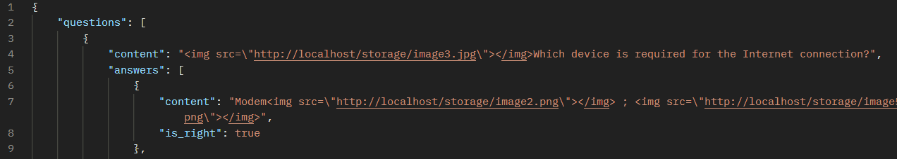

git clone {URL REPO}

После нужно ввести следующие команды

composer install

copy .env.example .env

php artisan key:generate

php artisan storage:link // для картинок
    

После запускаем докер

docker-compose up -d

Парсер для простого формата где есть @ - вопрос # - ответы

API:

    POST: http://localhost/api/parse
        BODY: file -> file

если есть картинки, они будут в контенте виде ссылки 

